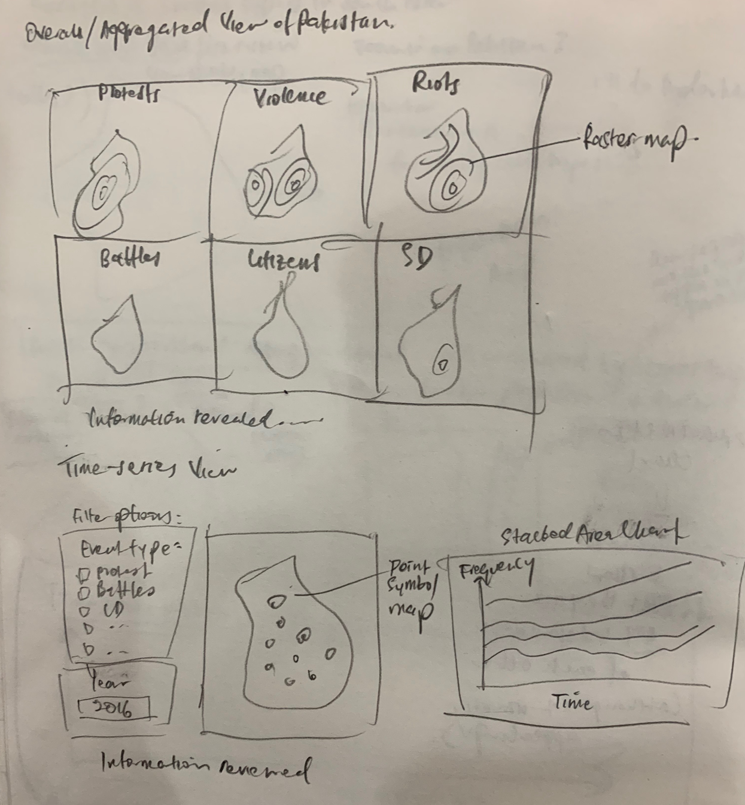

```{r setup, include=FALSE}
knitr::opts_chunk$set(echo = TRUE)
```

*The report below details the preliminary exploratory analysis for a project undertaken for the course ISSS608- Visual Analytics offered in SMU MITB. As one of the project deliverables, a Shiny application is built to allow users to explore and perform spatial point pattern analysis on the dataset at a deeper level. Please click on the [link here](https://deniseadele-chs.shinyapps.io/pointpatternACLED/) to explore the shiny application!*


# 1.0 Overview

## 1.1 Core Purpose of Dataviz Exercise

In this age of growing socio-political and cultural dissimilarities, the occurrences of armed conflicts have risen. Non-profit organizations like ACLED have been collating the data of such conflicts in a tabular form, analyzing such data and mapping the crisis of these events. It is of research interest to study the conflict environments and how the nature of conflicts and its intensity vary across space and time.

In this dataviz exercise, the analysis centers on Pakistan. The focus is to visualise how different types of armed conflicts are distributed across Pakistan, and simultaneously study how the intensity (frequency of occurrence) of each conflict types vary over time. It aims to answer the following questions:
-  Are regions divided into sub-regions where one type of event dominate?
-  Do these spatial patterns persist over time?


## 1.2 Components of visualisation

The types of data visualisations used, and corresponding rationales are listed below:

1. Point Symbol Map: Each point symbol on the map represent one occurrence of armed conflict. When all events are plotted on the map, it becomes visually evident if the 'intensity' (i.e. The average density of points per unit area) varies from location to location, and how the events are spatially segregated. One advantage is that information about each point event can be supplemented through labelling/ tooltips (which cannot be achieved with 2d density plot)

2. Kernel density (raster) map: Kernel density plot is another way to visualise spatial variation in density of point events. Using the **spatstat** package, the kernel density estimate is computed using Gaussian smoothing function, therefore intensity values across the study area are smoothened to make a continuous surface. Hence it can be visualised like a heat map and is useful to show which sub-regions are  hot spots for armed conflicts. Another benefit of density plots is that it is visually clearer (as it is supplemented with a quantitative value) to differentiate variation in density as compared to points, especially for cases where there are too many point events in a region and the map becomes too cluttered for effective visualisation.

3. Stacked Area Charts: Stacked area charts are useful to show how frequency and simultaneously the proportion of each conflict type, aggregated across the country evolves across time. Dygraphs are used here because of its highly interactive features including zoom/pan and series/point highlighting.


## 1.3 Sketch of proposed visualisation
```{r, out.width = "400px", fig.align='center', echo=FALSE}

```

# 2.0 Interactivity
The following interactive features are proposed to be incorporated in the data visualisations to enhance usability and hence user experience:
- View manipulation:  To allow users to manipulate the data by filtering conflict types and year, for a high-level or isolated view, to better examine distribution and patterns across time and space. This feature will be incorporated in the time-series analysis using point symbol maps. 
- Use of tooltips: Supplementing information about the point event on the point symbol maps when user hovers or clicks on the datapoint. This feature is also incorporated in the stacked area chart (dygraph) whereby frequency values are displayed on the graph upon series/point highlighting.  
- Pan and zoom: To allow user to navigate through large information spaces on maps (made interactive with leaflet). Through zooming and panning, users can view the overall distribution across country, or zoom in on a particular state. Zooming and panning is also a feature incorporated into dygraph, where users can zoom in on a shorter range of dates by toggling the slider selector at the bottom of the chart.


# 3.0 Step-by-step Data Visualisation Preparation
## 3.1 Installing and launching R packages

A list of packages are required for this makeover exercise. This code chunk installs the required packages and loads them onto RStudio environment.

```{r message=FALSE, warning=FALSE}
packages <- c('tidyverse','sf','RColorBrewer','dygraphs','viridis','ggpubr','GADMTools','tmap','here','rnaturalearthdata','gganimate','lubridate','plotly','ggmap','streamgraph','crosstalk','htmltools','leaflet','wordcloud2','tm','xts','raster','maptools','rgdal','spatstat','sp','rpanel','tkrplot','rgdal')

for (p in packages){
  if (!require(p,character.only=T)){
    install.packages(p)
  }
  library(p, character.only=T)
}
```


## 3.2 Data Preparation

### 3.2.1 Data Source 
The dataset used in this exercise is sourced from **The Armed Conflict Location and Event Data Project (ACLED)**, a project that collects data, provides analysis and performs crisis mapping on the reported political violence and protest activities around the world. In this data visualisation exercise, the focus is on conflicts in Pakistan occurring between 2016-2020. The data was exported from https://acleddata.com/.

### 3.2.2 Loading the dataset onto R
Data import was accomplished using `read_csv()` of **readr** package, which is useful for reading delimited files into a `tibble`.
```{r message=FALSE, warning=FALSE, results='hold'}
# Reading the csv file as a tbl_df
ACLED_SA <- read_csv("Data/2016-01-01-2019-12-31-Southern_Asia.csv")

# Inspecting the structure of the dataset
str(ACLED_SA)

```


As the dataframe contains ACLED data for 5 other Southern Asian countries that will not be included in this analysis, `filter()` will be used to subset out data associated with Pakistan. Also during data inspection, it was observed that the variable **event_date** is in string format. Therefore `as.Date()` along with `mutate()` will be used to convert the string datatype to date. Another column *monyear* will be created for subsequent time-series analysis aggregated by month and year.
```{r message=FALSE, warning=FALSE, results='hold'}
PAK_df <- ACLED_SA %>%
  filter(country=="Pakistan") %>%
  mutate(event_date=parse_date(event_date, "%d %B %Y"))%>%
  mutate(year=as.factor(year)) %>%
  mutate(month=month(event_date)) %>%
  mutate(monyear = as.Date(paste0(year,"-",month, "-01"),"%Y-%m-%d"))

head(PAK_df)
```

### 3.2.4 Creating `sf` dataframe from the aspatial dataframe
Similarly, the aspatial dataframe was converted to sf dataframe using `st_as_sf`. The Coordinate Reference System (CRS) is initially specified as EPSG4326, to align with the CRS for GADM file format. `st_transform` is then used to change the CRS to EPSG:24313 (Kalianpur 1962). This additional step is necessary to align the bbox. 

More information on Kalianpur 1962 can be found here https://epsg.io/24313.
```{r message=FALSE, warning=FALSE, results='hold'}
PAK_sf <- st_as_sf(PAK_df, 
                  coords = c("longitude", "latitude"),
                   crs=4326)

PAK_sf <- st_transform(PAK_sf, 24313)
```

### 3.2.5 Importing Geopackage of Pakistan
Geopackage (with file extension *.gpkg) is a type of geospatial vector data format to store geometric location and associated attribute information. The required geopackage was downloaded from the database of Global Administrative Areas (GADM) at https://gadm.org/data.html. 

The `st_read()` function of **sf** package is used to convert the geospatial data to a `sf` (Special Features) data. It is preferred over its predecessor `sp` as geospatial and attribute data can be stored in spatial dataframe which can be manipulated like tibble dataframes using standard functions in the `tidyverse` packages.

```{r message=FALSE, warning=FALSE, results='hold'}

# check available layers from a geopackage
st_layers(paste0(here::here(), "/Data/geopackage/gadm36_PAK.gpkg"))

# read in geopackage
PAK_sh1 <- st_read(dsn = paste0(here::here(), "/Data/geopackage/gadm36_PAK.gpkg"), layer="gadm36_PAK_1")

# Transform the CRS (source is using WGS84 datum)
PAK_sh1 <- st_transform(PAK_sh1, 24313)

```


## 3.3 Data Visualisations for Aggregated View
### 3.3.1 Plotting a Point Symbol Map

To improve user's experience by including information about the point event using the `id` and `popup.vars` argument. `id` will display the value of the data variable when user mouse hover over the datapoint. `popup.vars` displays (a list of) data variables when user clicks on the datapoint.
```{r message=FALSE, warning=FALSE, results='hold'}

PAK_tm <- tm_shape(PAK_sh1) +
  tm_text("NAME_1")+
  tm_fill() +
  tm_borders("black", lwd = 1) +
  tm_shape(PAK_sf) +  
  tm_dots(col="event_type", palette="Spectral", alpha= 0.5,
          id= "data_id",
          popup.vars= c("Country:"="country", "State/Province:"="admin1","Event Type"="event_type","Sub-Event Type"="sub_event_type","Primary actor"="actor1"))

tmap_leaflet(PAK_tm)

```


### 3.3.2 Plotting a kernel density map

#### 3.3.2.1 Computing Kernel Density Estimate with **spatstat**
**Spatstat** package will be used to compute the kernel density estimate of the intensity function. A new class of object `ppp` will created to use spatstat functions, however, there is no function that directly converts sf to ppp. Therefore, the data files are imported once again and read as `sp` objects.

The code chunk below converts the geopackage of Pakistan into a `SpatialPolygons` class object, and defines the study boundaries using `as.owin` function. As explained in sections 3.2.4 and 3.2.5, an additional step is required to transform the CRS to EPSG:24313 and convert units from m to km simultaneously. `spTransform()` is used for this purpose.

```{r message=FALSE, warning=FALSE, results='hold'}

PAK_sh2 <- readOGR(dsn = paste0(here::here(), "/Data/geopackage/gadm36_PAK.gpkg"), layer="gadm36_PAK_1")
PAK_sh_sp <- as(PAK_sh2,"SpatialPolygons")

# Transform the CRS (source is using WGS84 datum)
PAK_sh_sp <- spTransform(PAK_sh_sp, CRS=CRS("+init=epsg:24313 +proj=utm +zone=43 +a=6377301.243 +b=6356100.230165384 +towgs84=283,682,231,0,0,0,0 +units=km +no_defs"))

PAK_owin <- maptools::as.owin.SpatialPolygons(PAK_sh_sp)

```

The code chunk below converted the aspatial dataframe in `SpatialPoints` class object.
```{r message=FALSE, warning=FALSE, results='hold'}
xy <- PAK_df[,c("longitude","latitude")]
PAK_sp <- SpatialPointsDataFrame(coords = xy, data=PAK_df, proj4string =CRS("+init=epsg:4326"))
PAK_sp <- spTransform(PAK_sp, CRS=CRS("+init=epsg:24313 +proj=utm +zone=43 +a=6377301.243 +b=6356100.230165384 +towgs84=283,682,231,0,0,0,0 +units=km +no_defs"))
PAK_sp

```


Finally, the `sp` objects are converted to `ppp` objects. The output is plotted to verify that the boundaries defined by the `owin` object encloses the point pattern study area correctly.
```{r message=FALSE, warning=FALSE, results='hold'}
lon <- PAK_sp@coords[,1]
lat <- PAK_sp@coords[,2]

# Create two vectors xrange and yrange with dimensions of triangle that contain all points
xrange <- range(lon, na.rm=T)
yrange <- range(lat, na.rm=T)

# Specify event_type as a mark for splitting in subsequent analysis
PAK_ppp <- ppp(lon, lat, xrange, yrange, data=PAK_sp, marks=as.factor(PAK_sp$event_type))
PAK_sh_ppp <- PAK_ppp[PAK_owin]

plot(PAK_sh_ppp)
```

#### 3.3.2.2 Converting to Raster files

In order to plot the kernel density estimates (kde) using tmaps, the kde output from `density()` is required to be converted to `Raster` data. `Raster`. The resulting data is divided into grids/pixels, each grid storing the intensity of armed conflict within the defined boundary. Raster data for each event type is created using the code chunk below.

```{r message=FALSE, warning=FALSE, results='hold'}
Protests <- subset(PAK_sh_ppp, marks == "Protests") 
Explosion <- subset(PAK_sh_ppp, marks == "Explosions/Remote violence") 
Battles <- subset(PAK_sh_ppp, marks == "Battles")
Riots <- subset(PAK_sh_ppp, marks == "Riots") 
Strategic_developments <- subset(PAK_sh_ppp, marks == "Strategic developments") 
Violence<- subset(PAK_sh_ppp, marks == "Violence against civilians") 

dmap_Protests <- density(Protests)   
ras_Protests <- raster(dmap_Protests, crs="+init=epsg:24313 +proj=utm +zone=43 +a=6377301.243 +b=6356100.230165384 +towgs84=283,682,231,0,0,0,0 +units=km +no_defs")

dmap_Explosion <- density(Explosion)
ras_Explosion <- raster(dmap_Explosion, crs="+init=epsg:24313 +proj=utm +zone=43 +a=6377301.243 +b=6356100.230165384 +towgs84=283,682,231,0,0,0,0 +units=km +no_defs")

dmap_Battles <- density(Battles)
ras_Battles <- raster(dmap_Battles, crs="+init=epsg:24313 +proj=utm +zone=43 +a=6377301.243 +b=6356100.230165384 +towgs84=283,682,231,0,0,0,0 +units=km +no_defs")

dmap_Riots <- density(Riots)
ras_Riots <- raster(dmap_Riots, crs="+init=epsg:24313 +proj=utm +zone=43 +a=6377301.243 +b=6356100.230165384 +towgs84=283,682,231,0,0,0,0 +units=km +no_defs")

dmap_Strategic_developments <- density(Strategic_developments)
ras_Strategic_developments <- raster(dmap_Strategic_developments, crs="+init=epsg:24313 +proj=utm +zone=43 +a=6377301.243 +b=6356100.230165384 +towgs84=283,682,231,0,0,0,0 +units=km +no_defs")

dmap_Violence <- density(Violence)
ras_Violence <- raster(dmap_Violence, crs="+init=epsg:24313 +proj=utm +zone=43 +a=6377301.243 +b=6356100.230165384 +towgs84=283,682,231,0,0,0,0 +units=km +no_defs")


```


#### 3.3.2.3 Raster Maps with **leaflet**

The kde outputs are mapped onto leaflet basemaps using `addRasterImage`. *"quantile"* was passed into the *style* argument, which defines the method to process the color scale on which the intensity values are mapped. There many other options such as *"pretty"* and *"jenks"*, which will be explored in future works.

```{r message=FALSE, warning=FALSE, results='hold', echo=FALSE}

col_class1 <- classIntervals(values(ras_Explosion$layer), n = 100, style = "quantile")
pal1 <-colorBin(palette = "magma",                                 
              domain = col_class1$brks,                                  
              bins =col_class1$brks, pretty = FALSE,
              na.color = "transparent")

col_class2 <- classIntervals(values(ras_Protests$layer), n = 100, style = "quantile")
pal2 <-colorBin(palette = "magma",                                 
              domain = col_class2$brks,                                  
              bins =col_class2$brks, pretty = FALSE,
              na.color = "transparent")

col_class3 <- classIntervals(values(ras_Violence$layer), n = 100, style = "quantile")
pal3 <-colorBin(palette = "magma",                                 
              domain = col_class3$brks,                                  
              bins =col_class3$brks, pretty = FALSE,
              na.color = "transparent")

col_class4 <- classIntervals(values(ras_Strategic_developments$layer), n = 100, style = "quantile")
pal4 <-colorBin(palette = "magma",                                 
              domain = col_class4$brks,                                  
              bins =col_class4$brks, pretty = FALSE,
              na.color = "transparent")

col_class5 <- classIntervals(values(ras_Riots$layer), n = 100, style = "quantile")
pal5 <-colorBin(palette = "magma",                                 
              domain = col_class5$brks,                                  
              bins =col_class5$brks, pretty = FALSE,
              na.color = "transparent")

col_class6 <- classIntervals(values(ras_Battles$layer), n = 100, style = "quantile")
pal6 <-colorBin(palette = "magma",                                 
              domain = col_class6$brks,                                  
              bins =col_class6$brks, pretty = FALSE,
              na.color = "transparent")

kde_map <- leaflet(data=PAK_sh2,width="100%") %>%
  addProviderTiles(providers$CartoDB.Positron, group = "CartoDB") %>%
  addPolygons(color = "grey", fillColor = ~NAME_1, opacity = 1,fillOpacity = 0, weight=1,
              highlight = highlightOptions(
                weight = 3,
                color = "black",
                opacity = 1,
                fillOpacity = 0,
                bringToFront = TRUE),
              label = ~NAME_1,
              labelOptions = labelOptions(
                style = list("font-weight" = "normal", padding = "3px 8px"),
                textsize = "15px",
                direction = "auto")
              ) %>%
  addRasterImage(ras_Explosion, colors = pal1, opacity = 0.8, group="Explosion") %>%
  addRasterImage(ras_Protests, colors = pal2, opacity = 0.8, group="Protests") %>%
  addRasterImage(ras_Violence, colors = pal3, opacity = 0.8, group="Violence") %>%
  addRasterImage(ras_Strategic_developments, colors = pal4, opacity = 0.8, group="Strategic Developments") %>%
  addRasterImage(ras_Riots, colors = pal5, opacity = 0.8, group="Riots")  %>%
  addRasterImage(ras_Battles, colors = pal6, opacity = 0.8, group="Battles") %>%
      addLayersControl(
        overlayGroups = c("Explosion","Protestss","Violence","Strategic Developments","Riots","Battles"),
        options = layersControlOptions(collapsed = TRUE),
        position="topleft"
        ) %>% 
      leaflet::hideGroup("Explosion") %>%
      leaflet::hideGroup("Violence") %>%
      leaflet::hideGroup("Strategic Developments") %>%
      leaflet::hideGroup("Riots") %>%
      leaflet::hideGroup("Battles")

kde_map
```

```{r message=FALSE, warning=FALSE, results='hold', eval=FALSE, include=FALSE}
tmap_mode("plot")

tm_shape(ras_Explosion)+tm_raster(col="layer", style = "quantile", n = 20, legend.show = TRUE, palette=brewer.pal(9, "BuPu")) +
   tm_layout(frame = F, legend.format = list(format="g",digits=1), legend.outside = TRUE, legend.outside.position = "right", legend.text.size=0.2)
```


## 3.4 Time-Series Data Visualisations

### 3.4.1 User selection of Year with **crosstalk** package

One way to visualise the distribution of point events over time is to created faceted plots for different years. However one problem with facetting is that multiple maps are squeezed into a single screen and therefore becomes cluttered. Another good visualisation method would be to animate the point events across time with `tmap_animation()`.


In this visualisation, time-series is incorporated through view manipulation. This is achieved using `SharedData` function of **crosstalk** package. Crosstalk is able to support filter inputs to narrow down datasets for compatible HTML widgets within Rmarkdown page. Unfortunately crosstalk is only compatible with a few libraries such as leaflet, plotly, DT and rgl.

As such, the point symbol map will be created using **leaflet** package instead of of tmap.
Filter input options are incorporated for *year* and *event_type*.
```{r message=FALSE, warning=FALSE, results='hold'}


shared_PAK_sf <- SharedData$new(st_as_sf(PAK_df, 
                       coords = c("longitude", "latitude"),
                       crs= 4326))

pal <- colorFactor(brewer.pal(n = 6, name = "Spectral"),domain=shared_PAK_sf$event_type)
bscols(widths=c(3,9),
  list(
    filter_checkbox("event_type", "Event Type", shared_PAK_sf, ~event_type, columns = 1),
      filter_select("year", "Year", shared_PAK_sf , ~as.factor(year), allLevels = TRUE,
  multiple = FALSE)
  ),
  leaflet(shared_PAK_sf) %>% addProviderTiles(providers$CartoDB.Positron) %>%
    addCircleMarkers(color = ~pal(event_type), stroke = FALSE, fillOpacity = 0.5, radius=5,
                     label= ~data_id) %>%
    addMiniMap()
  )

```


### 3.4.2 Time-series analysis with **Dygraph**

In order to plot the dygraphs, further data manipulation is required to compute the frequency of each type of event for each month of each year. This can be achieved using `group_by` and `summarise` functions from the **dplyr** package.

Next, the dataframe needs to be in time-series format, i.e. each column contains frequency values and each row is indexed by time. In the code chunk below, `spread()` is used to spread the frequency of event types across columns. Then **xts** package is used to convert the dataframe into a time-series object. 
```{r message=FALSE, warning=FALSE, results='hold'}
PAK_freq <- PAK_df %>%
  group_by(monyear, country, event_type) %>%
  summarise(freq = n()) 

PAK_spread_ini <- PAK_freq %>%
  mutate(i = row_number()) %>%
  spread(event_type, freq) %>%
  dplyr::select(-i)
head(PAK_spread_ini)

PAK_spread_ini[is.na(PAK_spread_ini)] <- 0
PAK_spread_fin <-PAK_spread_ini %>%
  group_by(monyear) %>% 
  summarise(Battles=sum(Battles),`Explosions/Remote violence`=sum(`Explosions/Remote violence`),Riots=sum(Riots), `Strategic developments`=sum(`Strategic developments`),`Violence against civilians`=sum(`Violence against civilians`),Protests=sum(Protests)) 

head(PAK_spread_fin)

PAK_spread_xts <- xts(x = PAK_spread_fin[,-1], order.by = PAK_spread_fin$monyear)


PAK_spread_xts <- PAK_spread_xts[, c(6,5,4,3,2,1)]

```


The dygraph is then built with the code chunk below.
```{r message=FALSE, warning=FALSE, results='hold'}
PAK_dy <- dygraph(PAK_spread_xts,main = "Arm Conflict Profile in Pakistan (Stacked Area Chart)",ylab = "Frequency of Armed Conflicts",xlab = "Month-Year", width = "100%", height = "400") %>%
  dyHighlight(highlightCircleSize = 5, 
              highlightSeriesBackgroundAlpha = 0.2,
              highlightSeriesOpts = list(strokeWidth = 1.5),
              hideOnMouseOut = FALSE) %>%
  dyLegend(width = 550) %>%
  dyOptions(stackedGraph = TRUE, colors=RColorBrewer::brewer.pal(n=6,"Spectral")) %>%
  dyRangeSelector(height = 25)

PAK_dy
```


# 4.0 Final Visualisation
### Visualising the Distribution of Armed Conflict Types Across Pakistan
#### Aggregated View
```{r message=FALSE, warning=FALSE, results='hold', echo=FALSE}


tmap_mode("view")
kde_map
```


The raster maps facted by conflict type evidently show spatial inhomogenity, and intensity clusters are found at different regions for different conflict types. This goes to show that conflict environment varies across Pakistan since different conflict types are dominant in different regions.

#### Time-Series View

```{r message=FALSE, warning=FALSE, echo= FALSE}
browsable(
  tagList(list(
    tags$div(bscols(widths=c(3,9),
  list(
    filter_checkbox("event_type", "Event Type", shared_PAK_sf, ~event_type, columns = 1),
      filter_select("year", "Year", shared_PAK_sf , ~as.factor(year), allLevels = TRUE,
  multiple = FALSE)
  ),
  leaflet(shared_PAK_sf) %>% addProviderTiles(providers$CartoDB.Positron) %>%
    addCircleMarkers(color = ~pal(event_type), stroke = FALSE, fillOpacity = 0.5, radius=5) %>%
    addMiniMap()
  )
    ),
  tags$br(),
  tags$div(PAK_dy),
  tags$br(),
  tags$p("Total occurrences of armed conflicts in Pakistan has increased from 2016 to 2019. In particular, there is an increase in intensity of Protests, Riots and Violence against Citizens conflict types in 2018 and 2019 compared to years before. 

While there is evidence of growing intensity of conflicts in certain regions of Pakistan, there is spatial clustering of Battles and Explosions/Remote violence consistently observed in FATA and Khyber Pakhtunkhwa, while clustering of Protests consistently persists in Khyber Pakhtunkhwa, Azad Jammu and Kashmir, Sindh and Punjab across the years. Also interestingly, the aforementioned are the states bordering India.

There is one abnormal spike in conflicts in August 2019. Through text analysis (not described in this exercise), it was revealed that they were commonly triggered by political rallies against PM Imran Khan and to repeal Article 370 of the Indian constitution, occuring in Khyber Pakhtunkhwa, Azad Jammu and Kashmir and Punjab."),
tags$br(),
tags$br(),
tags$br()
  ))

)


```

 
 
# 5.0 Three Major Advantages of Incorporating Interactivity

1. Flexible data analysis through view manipulation: To enable users to explore large datasets and have the flexiblity to manipulate the views of interest by filtering/subsetting, through user controls. This also allows users to switch from high-level analysis to isolated and focused analysis by looking at data on a higher granularity.

2. Multiple questions answered: The ability to change data view and reactive computation/ modelling with user input allows users to obtain relevant information to answer questions that might arise through the entire process of data analysis.  

3. Enhance User Experience: Interactivity with hover text and tooltips provide detail-on-demand without having too many information cluttered on one screen. It is a more powerful visualisation tool as users are able to explore data they are interested in, instead of having to plough through a bunch of static charts to find information that they require.

